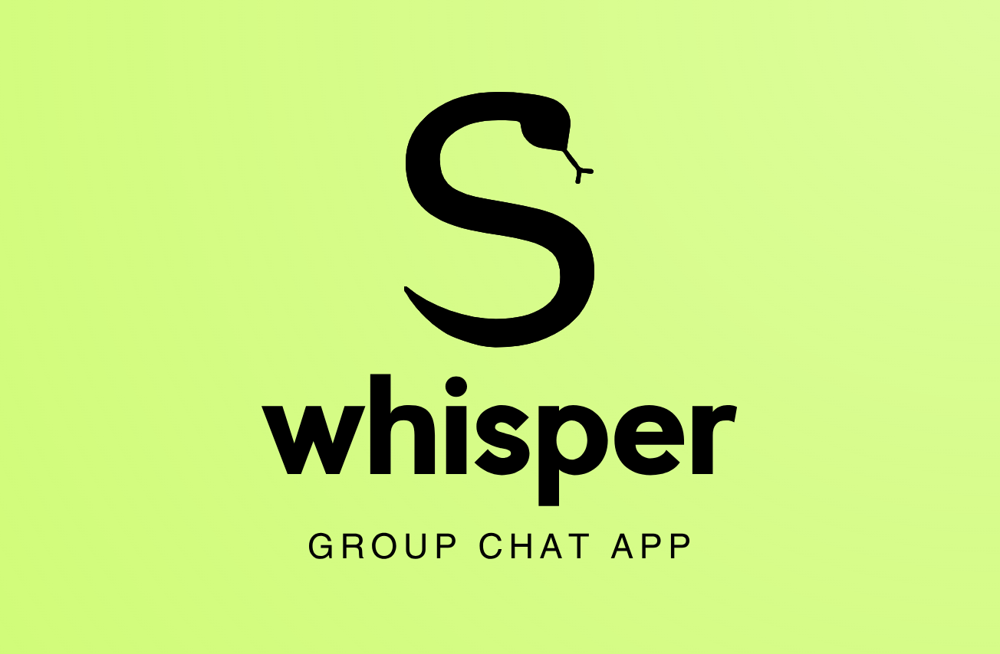
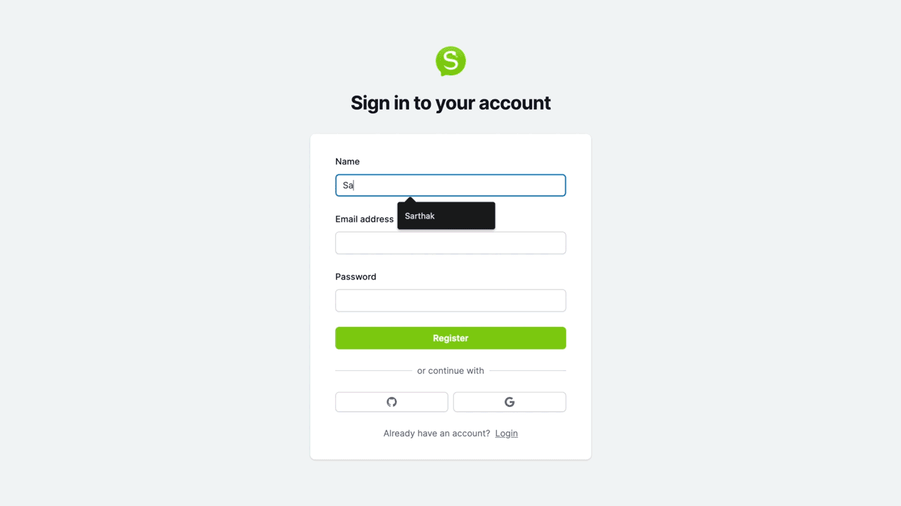
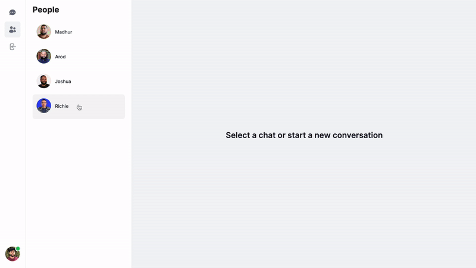
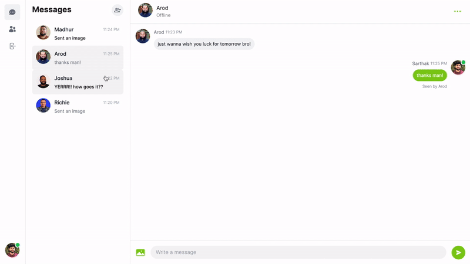
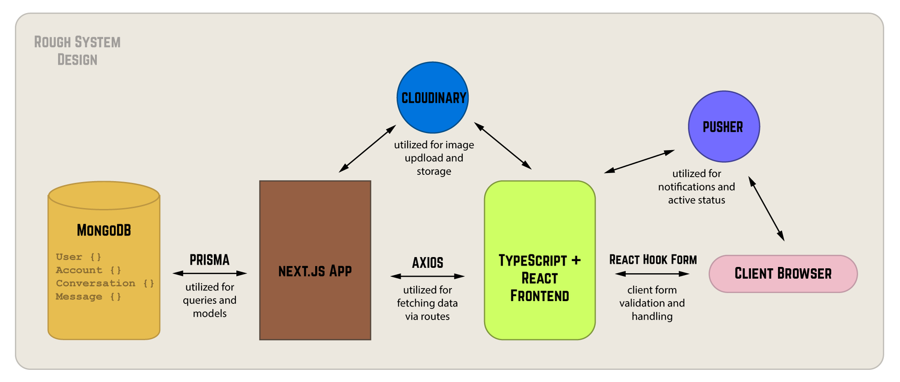

# Whisper

A full-stack web application that allows users to chat with their friends 1:1 or in groups. Built with TypeScript, React, Next.js, Prisma, MongoDB, Cloudinary API, and Pusher. [Live Link](https://messenger-x-gamma.vercel.app)<br/>
<br/>

<br/>

### Functionality

Whisper allows a user to -
- Sign up and create an account.
- Edit their account details - name and profile picture.
- Real-time messaging using Pusher.
- Message other users in a 1:1 chat.
- Message other users in a group chat of 3 or more users.
- Receive message notifications and alerts.
- Exchange text messages, emojis, and images.
- View read receipts and message timestamp information.
- Fully responsive across all devices.
- Remain auto-logged in after sign-up/log-in.

### Demo

1. Sign Up

<br/>

2. Edit Profile

<br/>

3. 1:1 Chat with Read Receipts and Active Status

<br/>

4. Send Images

<br/>

5. Group Chat with Active Status

<br/>

### Architecture

<br/>

### Technologies Used

- TypeScript
- React
- Next.js
- Prisma
- MongoDB
- Cloudinary API


### How to Run Locally

Step 1 - Clone the repository in a new directory:
```bash
git clone https://github.com/sarthak-wadhawan/whisper.git
```

Step 2 - Create .env file in root directory with the following info:
```bash
#MongoDB Database (mongodb.com/docs)
DATABASE_URL=

#NextAuth (next-auth.js.org/getting-started/introduction)
NEXTAUTH_SECRET="NEXTAUTH_SECRET"

#Github Auth (github.com/settings/apps)
GITHUB_ID=
GITHUB_SECRET=

#Google Auth (developers.google.com/identity/sign-in/web/sign-in)
GOOGLE_CLIENT_ID=
GOOGLE_CLIENT_SECRET=

#Cloudinary CDN (next.cloudinary.dev)
NEXT_PUBLIC_CLOUDINARY_CLOUD_NAME=

#Pusher (pusher.com/docs/channels/getting_started/javascript/)
NEXT_PUBLIC_PUSHER_APP_KEY=
PUSHER_APP_ID=
PUSHER_SECRET=
```

Step 3 - Push DB Schema
```bash
npx prisma db push

```
Step 4 - Run app locally
```bash
npm run dev
```


